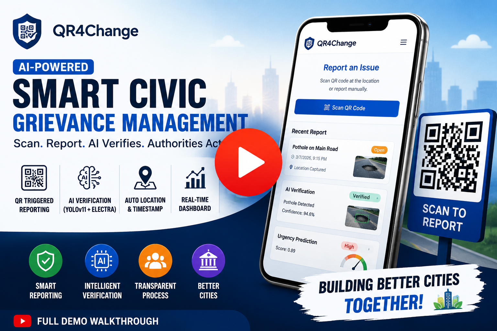
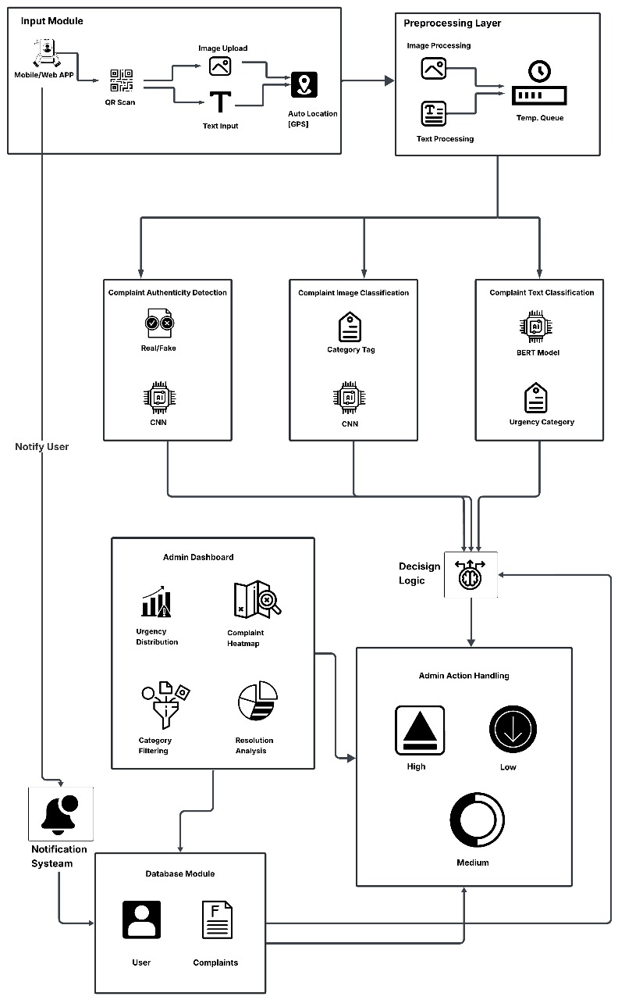

#  QR4Change: Empowering Communities with Smart Civic Solutions


## Try QR4Change Live :

<p align="center">
  <strong>Experience QR4Change — an AI-powered Smart Civic Grievance Management System.</strong><br><br>
  Report civic issues, explore the interactive dashboard, and experience the complete platform directly in your browser.
</p>

<br> <br>

<p align="center">
  <a href="https://qr4change.vercel.app/" target="_blank">
    
  </a>
</p>

<br><br>

[](https://qr4change.vercel.app/)
[](#)
[](#)
[](#)

<p align="center">
  <strong>✨ No Installation Required • 🤖 AI Powered • 📱 Mobile Friendly • ⚡ Real-Time Dashboard</strong>
</p>


---


## 🎥 Project Walkthrough

<p align="center">
Watch the complete walkthrough of <strong>QR4Change</strong> to explore the AI-powered civic grievance reporting workflow.
</p>

<p align="center">
  <a href="https://youtu.be/l2flXN1malc" target="_blank">
    
  </a>
</p>

<p align="center">
<b>▶️ Click the thumbnail above to watch the full demo on YouTube.</b>
</p>


[](https://opensource.org/licenses/MIT)
[](https://github.com/yash-maske/QR4Change-2.0)
[](https://github.com/yash-maske/QR4Change-2.0)
[](https://github.com/yash-maske/QR4Change-2.0) 

<br>

---

##  Overview

**QR4Change** is a revolutionary **Smart QR-Based Civic Grievance Reporting System** designed to bridge the gap between citizens and municipal authorities in India. By leveraging **QR codes**, **AI-powered verification**, and a **user-friendly interface**, QR4Change simplifies the process of reporting urban issues like potholes, garbage dumps, and broken infrastructure. Citizens can scan QR codes at hotspot locations to file complaints effortlessly, while authorities receive verified, prioritized issues for swift resolution. With real-time tracking and transparent dashboards, QR4Change fosters trust and accountability, paving the way for smarter cities.

 **Why QR4Change?** It eliminates bureaucratic hurdles, ensures authentic complaints using deep learning, and prioritizes urgent issues with NLP, making civic engagement accessible and efficient.

 **Learn More:** Check out our [research paper](./QR4Change-2.0-master/QR4Change.docx) for a deep dive into the system.

---

##  Key Features

- **QR Code Reporting:** Scan QR codes at civic hotspots to access pre-filled complaint forms with geotagged metadata (location, ward).
- **AI-Driven Verification:** Uses YOLOv11n (potholes) and InceptionV3 (garbage) to validate complaints, filtering out spam.
- **Urgency Scoring:** NLP-powered ELECTRA model classifies complaints as High or Low urgency for effective prioritization.
- **Responsive Interface:** Built with ReactJS and TypeScript for seamless access on mobile and desktop.
- **Public Dashboard:** Real-time heatmaps, filters, and status updates for transparency and accountability.
- **Feedback Loop:** Citizens receive resolution notifications and can provide feedback to ensure satisfaction.
- **Scalable & Secure:** Powered by Express.js, Django, and MongoDB for robust, secure, and scalable operations.

---

##  System Architecture

QR4Change integrates six modules for a seamless grievance redressal process, combining cutting-edge AI with user-friendly design.

 <!-- Replace with actual image path -->

### Core Modules
1. **QR Code Generation:** Unique QR codes with embedded metadata for quick complaint initiation.
2. **Citizen Interface:** ReactJS-based form for easy reporting with auto-filled location data.
3. **Complaint Verification:** CNN models ensure only valid issues (e.g., potholes, garbage) proceed.
4. **Urgency Scoring:** NLP model prioritizes critical issues based on text analysis.
5. **Backend Management:** Express.js APIs and MongoDB for complaint routing and storage.
6. **Public Dashboard:** Heatmaps and filters for real-time issue tracking.

### Workflow
1. **Scan QR Code** → Auto-filled form opens.
2. **Submit Complaint** → Upload image and description.
3. **AI Verification** → Validates issue authenticity.
4. **Urgency Scoring** → Assigns priority (High/Low).
5. **Routing** → Sends to relevant department.
6. **Track Progress** → View status on public dashboard.
7. **Resolution** → Citizens confirm or escalate.

---

##  Project Structure

The repository is organized for clarity and modularity:

```
qr4change/
├── client/                   # Frontend (React + Vite + TypeScript)
│   ├── src/
│   │   ├── components/       # UI components (forms, dashboard)
│   │   ├── pages/            # Pages (reporting, dashboard)
│   │   ├── assets/           # Images, CSS
│   │   └── App.tsx           # Main app
│   ├── vite.config.ts        # Vite config
│   ├── tsconfig.json         # TypeScript config
│   └── package.json          # Dependencies
├── server/                   # Express backend (APIs + MongoDB)
│   ├── src/
│   │   ├── routes/           # API routes
│   │   ├── models/           # MongoDB schemas
│   │   ├── controllers/      # Logic
│   │   └── config/           # DB connection
│   ├── .env                  # Environment variables
│   └── package.json          # Dependencies
├── models/                   # Django server (AI model processing)
│   ├── qr4change/
│   │   ├── migrations/       # DB migrations
│   │   ├── models.py         # Django models
│   │   ├── views.py          # AI endpoints
│   │   └── urls.py           # URL routing
│   ├── manage.py             # Django script
│   └── requirements.txt      # Python dependencies
├── media/                    # Images (e.g., architecture diagram)
├── QR4Change.docx            # Research paper
├── LICENSE                   # MIT License
└── README.md                 # This file
```

---

##  Tech Stack

- **Frontend:** 
  - ReactJS (UI), Vite (fast builds), TypeScript (type safety)
  - Tailwind CSS (styling)
- **Backend:** 
  - Express.js (RESTful APIs)
  - Django (AI model serving)
- **Database:** MongoDB (scalable NoSQL)
- **AI/ML:**
  - **Computer Vision:** YOLOv11n (potholes), InceptionV3 (garbage), DeepLabV3-ResNet101 (road segmentation)
  - **NLP:** ELECTRA (urgency scoring)
- **Other:** Node.js, Python, Data Augmentation, Adam Optimizer, Metrics (Accuracy, Precision, Recall, F1-Score, mAP, IoU)

---

##  Installation & Setup

### Prerequisites
- **Node.js** (v18+)
- **Python** (v3.10+)
- **MongoDB** (local or cloud)
- **Git**

### Steps
1. **Clone the Repository:**
   ```bash
   git clone https://github.com/yash.maske/QR4Change-2.0.git
   cd qr4change
   ```

2. **Frontend Setup:**
   ```bash
   cd client
   npm install
   npm run dev  # Starts at http://localhost:5173
   ```

3. **Backend Setup (Express):**
   ```bash
   cd ../server
   npm install
   # Create .env with: MONGO_URI=mongodb://localhost:27017/qr4change
   npm start  # Starts at http://localhost:5000
   ```

4. **AI Models Setup (Django):**
   - **Download AI Models:**
     - **Garbage Model (InceptionV3):** Download from [this link](https://drive.google.com/file/d/1qXP8gkIiYJjqYF5ANI-BV2zcTj032wXL/view?usp=drive_link).
       - Place the downloaded model file in the `models/weights/` folder.
     - **Urgency Scoring Model (ELECTRA):** Download from [this link](https://drive.google.com/file/d/1jXstGy7jAqMQEFXdVZiiTySa2BLde4jf/view?usp=drive_link).
       - Place the downloaded model file in the `models/electra_3k_mix/` folder.
   - **Setup Django Backend:**
     ```bash
     cd ../models
     python -m venv venv
     source venv/bin/activate  # Windows: venv\Scripts\activate
     pip install -r requirements.txt
     python manage.py migrate
     python manage.py runserver  # Starts at http://localhost:8000
     ```

5. **MongoDB Setup:**
   - Start MongoDB: `mongod`
   - Seed QR code metadata if needed.

6. **Environment Variables:**
   - `server/.env`: `MONGO_URI`, `PORT=5000`
   - `models`: Configure AI model paths in Django settings.

7. **Run Full System:**
   - Ensure all servers are running.
   - Access frontend at `http://localhost:5173`.

---

##  Usage Guide

### For Citizens
1. **Report an Issue:**
   - Scan a QR code at a hotspot (or use a demo URL).
   - Fill the pre-filled form, upload an image, and submit.
2. **Track Complaints:**
   - Visit `/dashboard` to view status and heatmaps.

### For Authorities
1. **Manage Complaints:**
   - Login to the secure admin dashboard.
   - Filter and update complaint statuses (Pending, In Progress, Resolved).
2. **Upload Evidence:**
   - Add resolution photos or comments.

### API Endpoints
- **Express (Server):**
  - `POST /api/complaints`: Submit complaint
  - `GET /api/complaints/:id`: Track status
  - See `server/README.md` for full docs.
- **Django (Models):**
  - `POST /verify`: Image verification
  - `POST /urgency`: Text scoring

**Demo:** Use Postman for API testing or run locally.

---

##  Methodology

### Dataset Collection
- **Images:** 
  - Potholes: 1,780 images (1,014 potholes, 750 plain roads)
  - Garbage: 712 images (severe garbage, non-garbage)
  - Augmented with rotation, cropping, brightness adjustments.
- **Text:** 
  - 3,785 complaints (1,965 Low, 1,793 High urgency)
  - Manual + LLM-generated (Gemini) for diversity.

### Verification Model
- **Architecture:** DeepLabV3 (road check), YOLOv11n (potholes), InceptionV3 (garbage).
- **Training:** Adam optimizer, Categorical Cross-Entropy loss.
- **Metrics:** Accuracy, Precision, Recall, F1-Score.

### Urgency Scoring
- **Preprocessing:** ELECTRA tokenizer for contextual embeddings.
- **Training:** Fine-tuned ELECTRA, frozen lower layers, balanced class weights.
- **Metrics:** 99.73% Accuracy, 100% Recall.

### Complaint Routing
- Maps complaints to departments based on type, location, and urgency.
- Dashboards for real-time tracking and transparency.

---

##  Experimental Results

### Model Performance
| Metric          | InceptionV3 (Garbage) | YOLO11n (Potholes) |
|-----------------|-----------------------|--------------------|
| Accuracy       | 90.23%               | 99.43%            |
| Precision (No) | 0.93                 | 1.00              |
| Recall (No)    | 0.80                 | 1.00              |
| F1 (No)        | 0.86                 | 0.99              |
| Precision (Yes)| 0.84                 | 0.99              |
| Recall (Yes)   | 0.95                 | 0.99              |
| F1 (Yes)       | 0.89                 | 0.99              |

- **Urgency Model:** 99.73% Accuracy, 99.72% F1-Score, 100% Recall.
- **Efficiency:** Inference time <100ms, mobile-friendly.
- **Confusion Matrices:** See [research paper](./QR4Change-2.0-master/QR4Change.docx) for visuals.

---

##  Contributors

- **Chandrakant Thakare** - [chandrakant.22310303@viit.ac.in](mailto:chandrakant.22310303@viit.ac.in)
- **Yash Maske** - [yash.22310125@viit.ac.in](mailto:yash.22310125@viit.ac.in)
- **Sakshi Lokhande** - [sakshi.22310541@viit.ac.in](mailto:sakshi.22310541@viit.ac.in)
- **Shubhankar Jakate** - [shubhankar.22310371@viit.ac.in](mailto:shubhankar.22310371@viit.ac.in)

*Dept. of CSE AI, Vishwakarma Institute of Information Technology, Pune, India*

---

##  License

Licensed under the [MIT License](LICENSE). Feel free to use, modify, and distribute.

---

##  References

Full references are in the [research paper](./QR4Change-2.0-master/QR4Change.docx). Key inspirations include:
- Smart city grievance systems (IJRPR, JETIR)
- AI in complaint management (LeewayHertz, Civica)
- QR-based feedback systems (Daily Excelsior, CNBC TV18)

---

## 🙏 Acknowledgements

We thank **Vishwakarma Institute of Information Technology** for their support. Gratitude to open-source datasets, field visits in Pune, and inspirations from CPGRAMS and Bharosa-QR. Let's build smarter cities together! 🌍
